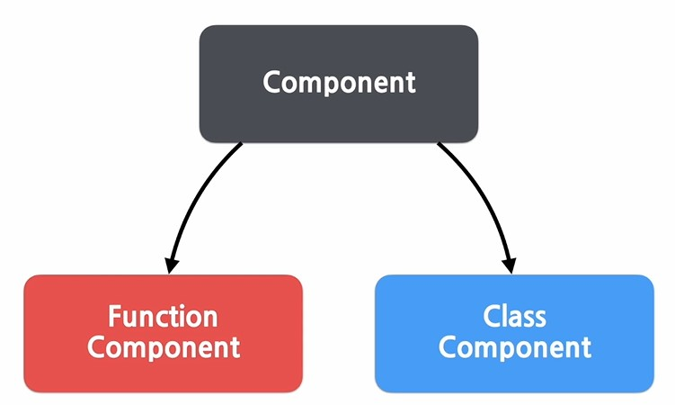
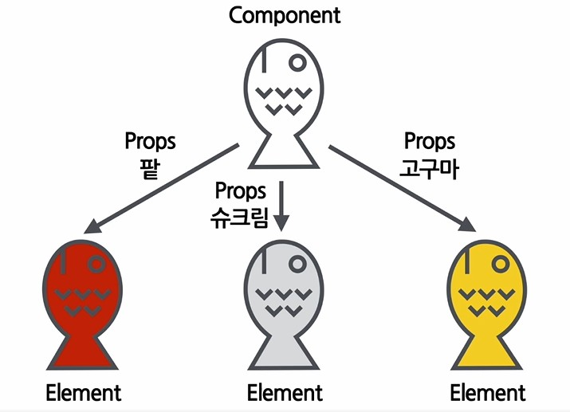

# Component

> React : Component Based

- 입력(Props)과 출력(React element)
- All React components must act like pure functions with respect to their props
- 즉, 모든 리액트 컴포넌트는 Props를 직접 바꿀 수 없고, 같은 Props에 대해서는 항상 같은 결과를 보여줘야 함
- JavaScript function
  - pure function : 입력값(input)을 변경하지 않으며, 같은 입력값에 대해서는 항상 같은 출력값(output)을 리턴
  - impure function : 입력값을 변경


<br>

- React Component의 종류



<br>

- Function Component

  ```jsx
  function Welcome(props){
      return <h1>안녕, {props.name}</h1>;
  }
  ```

- Class Component

  ```jsx
  Class Welcome extends React.Component{ //상속
      render(){
          return <h1>안녕, {this.props.name}</h1>;
      }
  }
  ```

<br>

- Component 이름
  - 항상 대문자로 시작해야 함 (React는 소문자로 시작하는 컴포넌트를 DOM tag로 인식하기 때문)
- Component 렌더링
  - Component로 만들어진 Element를 렌더링


<br>

- Component **합성**
  - 여러개의 컴포넌트를 합쳐서 하나의 컴포넌트를 만드는 것
  - 컴포넌트 안에 또다른 컴포넌트 사용
  - 복잡한 화면을 여러 개의 컴포턴트로 나눠서 구현 가능
- Component **추출**
  - 복잡한 컴포넌트를 쪼개서 여러개의 커포넌트로 나눔
  - 재사용성이 높아짐
  - 컴포넌트가 작아질 수록 해당 컴포넌트의 기능과 목적이 명확해짐, props도 단순해짐
  - 개발 속도 향상


<br>

# Props

> prop : property (속성)

- React Component의 속성




- Component에 전달할 다양한 정보를 담고 있는 **자바스크립트 객체**

- 특징

  - Read-Only, 값을 변경할 수 없음
  - 새로운 값을 Component에 전달하여 새로운 Element 생성

- 사용법

  ```jsx
  function App(props){
      retrun(
      	<Profile name="리액트" introduction="안녕, 난 리액트야." viewCount={1500} />
      );
  }
  
  /*
  props : js 객체
  {
  	name: "리액트",
  	introduction: "안녕, 난 리액트야.",
  	viewCount: 1500
  	
   }
  */
  
  // Props의 값으로 Component 사용 가능
  functio App(props){
      return(
      	<Layout
           	width={2500}
              height={1440}
              header={
                  <Header title="리액트 페이지입니다." />
              }
              fooer={
                  <Footer />
              }
           />
      );
  }
  
  ```

  
